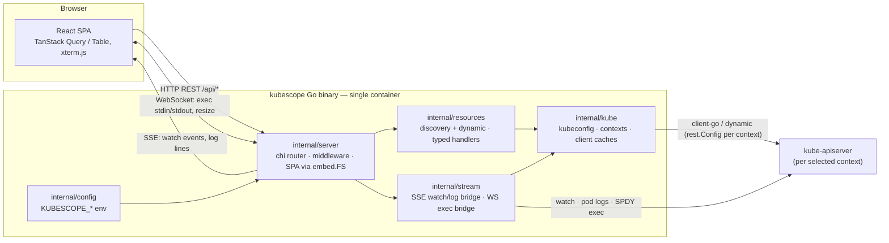
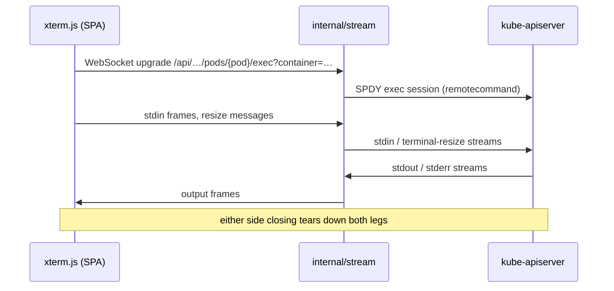

# Kubescope — Architecture

One Go binary serves the API and the embedded React SPA; talks to any cluster in the mounted kubeconfig via client-go (typed) and the discovery API + dynamic client (generic, incl. CRDs). See [adr/0001-tech-stack-and-build-from-scratch.md](adr/0001-tech-stack-and-build-from-scratch.md) and [adr/0002-single-binary-embedded-spa.md](adr/0002-single-binary-embedded-spa.md).

## System diagram



## Component breakdown

| Component | Package | Responsibility |
|---|---|---|
| Router / SPA / middleware | `internal/server` | chi routes under `/api`, embedded SPA with fallback serving, read-only middleware, auth toggle (Sprint 8) |
| Kubeconfig & context manager | `internal/kube` | Parse mounted kubeconfig, enumerate contexts, build + cache `rest.Config`/clients per context, per-context health checks |
| Generic resource engine | `internal/resources` | Discovery of all API groups/resources incl. CRDs (cached, refreshable); dynamic-client get/list/patch/delete; cluster- vs namespace-scope handling ([adr/0003](adr/0003-generic-resource-access-via-discovery-and-dynamic-client.md)) |
| Typed workload handlers | `internal/resources` | Shaped summaries for Pods/Deployments/StatefulSets/DaemonSets/ReplicaSets/Jobs/CronJobs; scale, rollout-restart, cordon/drain |
| Watch/log/exec streaming | `internal/stream` | Informer→SSE fan-out per context, pod log follow over SSE, exec over WebSocket⇆SPDY, port-forward ([adr/0006](adr/0006-live-updates-sse-and-streaming-websocket.md)) |
| Env config | `internal/config` | Load + validate `KUBESCOPE_*` env vars |
| Frontend | `web/` | Thin React SPA; all server state via TanStack Query; backend does aggregation/shaping |

## Data flows

### 1. List a resource (any GVK, incl. CRDs)

1. SPA → `GET /api/…/resources/{group}/{version}/{resource}?namespace=…`.
2. `internal/server` routes to the resource engine; `internal/kube` supplies the cached dynamic client for the active context.
3. Cached discovery resolves the GVR and its scope (namespaced vs cluster).
4. Dynamic client `List` hits the kube-apiserver.
5. Backend shapes rows server-side (columns, status derivation) and returns JSON.
6. TanStack Query caches; TanStack Table renders. Live updates then arrive via the SSE watch bridge (flow 2 pattern).

### 2. Stream pod logs (SSE)

1. SPA opens an `EventSource` on `GET /api/…/pods/{pod}/logs?follow=true&container=…&tailLines=…`.
2. `internal/server` sets `text/event-stream`; hands off to `internal/stream`.
3. `internal/stream` starts a client-go pod-log request with `Follow` against the apiserver.
4. Log lines are copied into SSE events as they arrive.
5. Client disconnect cancels the request context, closing the upstream stream. Same bridge pattern serves informer watch events for live lists.

### 3. Exec into a pod (WebSocket ⇆ SPDY)



**Exec WebSocket wire protocol** (Sprint 6, `internal/stream/exec.go` ⇄ `web/src/lib/exec-socket.ts`). The route `GET /api/v1/stream/pods/{namespace}/{name}/exec?container=&command=` upgrades to a WebSocket carrying two frame kinds:

- **Binary frames** — raw terminal bytes. Client→server is stdin (keystrokes, pastes); server→client is stdout/stderr merged (TTY mode collapses them into one stream). stdin must be binary; a text frame is read as a control message.
- **Text frames** — a JSON control message. Client→server sends `{"type":"resize","cols":C,"rows":R}` on a terminal resize. Server→client sends exactly one terminal frame just before it closes the socket: `{"type":"exit","code":N}` when the remote process exits (N is its exit code), or `{"type":"error","message":"…"}` for a failure (pod gone, bad container, RBAC denied, transport error). The close status code mirrors the intent (normal closure on exit, internal error on failure); the control frame is the authoritative, untruncated payload.

Teardown: a client disconnect cancels the SPDY session (no leaked goroutines); the remote process exiting closes the WebSocket with the structured reason above; a context switch or server shutdown tears every session down. `KUBESCOPE_READ_ONLY=true` rejects the upgrade with a 403 before it upgrades (the route lives in the read-only mutation group).

### 4. Port-forward a pod (backend-managed sessions)

Port-forwards are control operations, not streams, so they are a plain HTTP API over a per-context registry (`internal/stream/portforward.go`):

- `POST /api/v1/portforwards` `{namespace, pod, remotePort, localPort?}` — establishes a client-go SPDY port-forward and binds a **loopback** (`127.0.0.1`) listener; `localPort` 0 auto-assigns. Returns the active forward (with the bound local port). Gated by read-only mode.
- `GET /api/v1/portforwards` — lists active forwards (pod, ports, context, `startedAt`).
- `DELETE /api/v1/portforwards/{id}` — stops a forward (idempotent); the listener closes immediately.

A forward that dies on its own (pod deleted mid-forward) is dropped from the registry by a watcher. Forwards bind loopback only; reaching a forwarded port from the container host requires publishing it (`docker run -p`). Like exec sessions, forwards are per-context and torn down on a context switch or server shutdown.

## Deployment model

Single container, single process ([adr/0002](adr/0002-single-binary-embedded-spa.md)):

```sh
docker run --rm -p 8080:8080 -v ~/.kube/config:/kubeconfig:ro ghcr.io/skriptvalley/kubescope:latest
```

- Kubeconfig mounted **read-only** at `/kubeconfig`. Embedded certs/tokens work as-is; file-path certs, exec-auth plugins (EKS/GKE), and local clusters (`127.0.0.1` apiservers) have documented gotchas — [adr/0004](adr/0004-cluster-auth-and-kubeconfig-in-docker.md).
- Binds `127.0.0.1:8080` as a bare binary; the image sets `0.0.0.0:8080` (container boundary is the isolation) — [adr/0005](adr/0005-security-posture-read-only-and-secret-masking.md).

| Env var | Default | Meaning |
|---|---|---|
| `KUBESCOPE_LISTEN_ADDR` | `127.0.0.1:8080` | Full listen address (`host:port`) |
| `KUBESCOPE_PORT` | `8080` | Port shorthand; overrides the port part of `LISTEN_ADDR` |
| `KUBESCOPE_KUBECONFIG` | `/kubeconfig`, falling back to `$KUBECONFIG`, then `~/.kube/config` | Path to kubeconfig |
| `KUBESCOPE_READ_ONLY` | `false` | Reject all mutating operations when `true` |
| `KUBESCOPE_AUTH_MODE` | `none` | `none` \| `basic` \| `oidc` (basic/oidc land in Sprint 8) |
| `KUBESCOPE_ALLOW_KUBECONFIG_SET` | `false` | Enable the runtime set-kubeconfig endpoint (`PUT /api/v1/kubeconfig`, path-only; [adr/0007](adr/0007-runtime-kubeconfig-source.md)) |

## v2 seams

Deliberate extension points — no restructuring needed:

- **Resource-graph service** — new `internal/graph` package consuming the existing discovery cache and per-context dynamic clients from `internal/kube`/`internal/resources`. Edges come from `ownerReferences`, label selectors, and config/secret/volume refs already present in fetched objects; exposed as new routes in `internal/server` and a new SPA view. Nothing in the current packages changes.
- **Metrics adapter** — new `internal/metrics` package wrapping the metrics-server API using the same per-context `rest.Config` from `internal/kube`. Workload/node detail views gain optional CPU/mem panels that degrade gracefully when metrics-server is absent.
- **Multi-cluster side-by-side** — `internal/kube` already caches clients per context; side-by-side is a routing + UI concern, not a backend rework.
